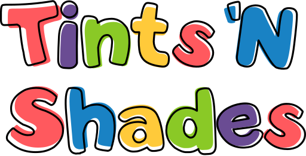

<div align="center">



### The tints & shades generator for CLI lovers ❤️

</div>

## Usage

Install Tints 'N Shades (TNS) using [Bundler](https://bundler.io/).

```bash
bundle install tints-n-shades
```

Run `tns generate` (or the short variant, `tns g`) with any color you need tints and shades for in hex format.

```bash
 tns g #ff7d00
--primary-100=#ffe5cc;
--primary-200=#ffcb99;
--primary-300=#ffb166;
--primary-400=#ff9733;
--primary-500=#ff7d00;
--primary-600=#cc6400;
--primary-700=#994b00;
--primary-800=#663200;
--primary-900=#331900;
```

### Color Formats

TNS supports outputs in Hex, HSL and RGB formats using the `--color-format` / `-c` argument.

```bash
tns g #ff7d00 -c hex
--primary-100=#ffe5cc;
--primary-200=#ffcb99;

 tns g #ff7d00 --color-format hsl
--primary-100=hsl(29 100 90);
--primary-200=hsl(29 100 80);
...

 tns g #ff7d00 --color-format rgb
--primary-100=rgb(255 229 204);
--primary-200=rgb(255 203 153);
...
```

### Output Formats

TNS supports outputting color palettes as CSS variables, SCSS variables, or Tailwind configuration.

```bash
tns g #ff7d00 -c hex
--primary-100=#ffe5cc;
--primary-200=#ffcb99;

 tns g #ff7d00 --color-format hsl
--primary-100=hsl(29 100 90);
--primary-200=hsl(29 100 80);
...

 tns g #ff7d00 --color-format rgb
--primary-100=rgb(255 229 204);
--primary-200=rgb(255 203 153);
...
```

### Others

To change the name of your color use the `--name` / `-n` argument. For additional configuration options see

```
tns help generate
```

## Credit

https://maketintsandshades.com/

https://www.tints.dev/

https://github.com/halostatue/color
